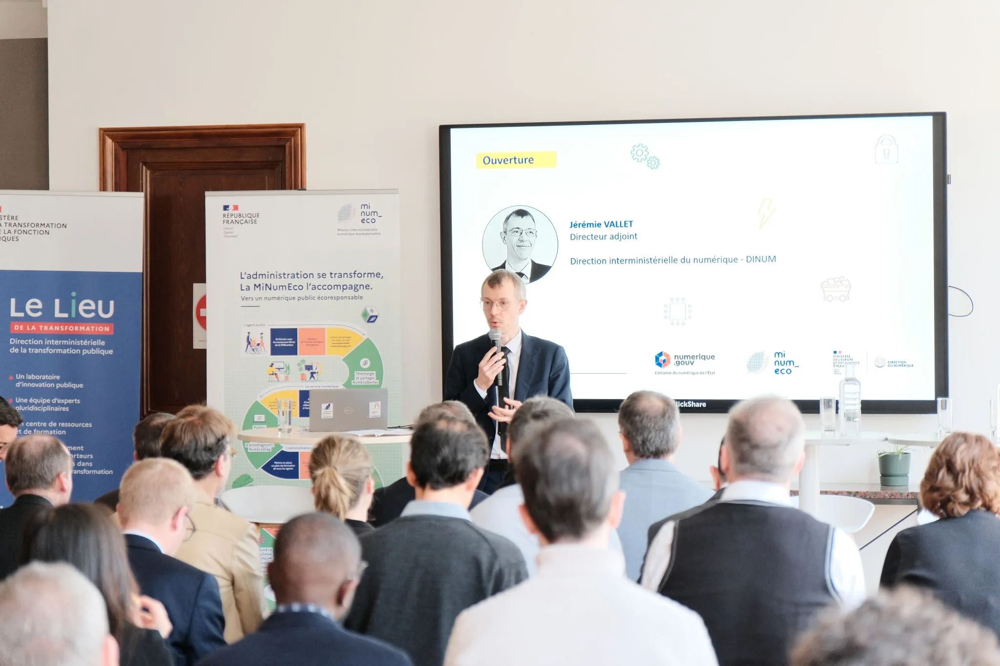
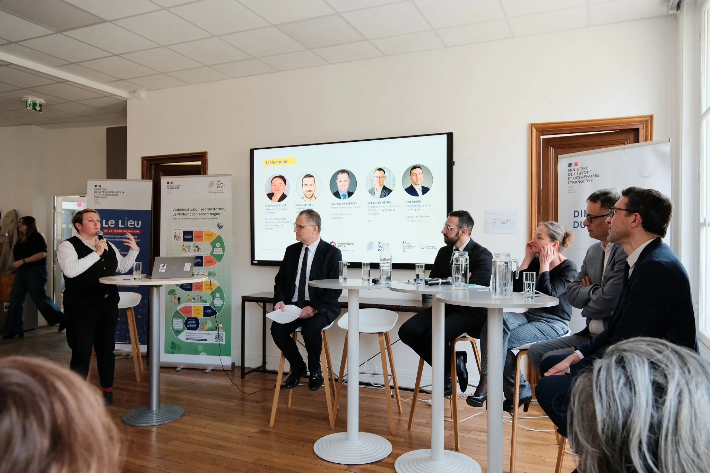
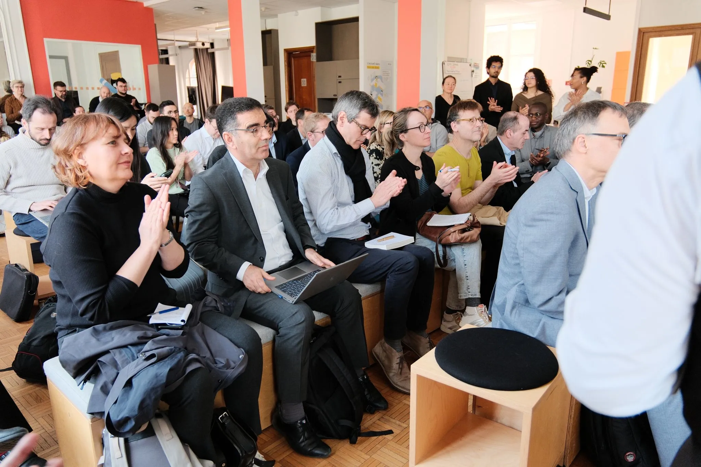

<!-- chapô -->
Dans le cadre de la **Semaine NumEco**, la Direction interministérielle du numérique (DINUM) et la Direction du numérique du ministère de l’Europe et des Affaires étrangères (MEAE) ont réuni, le 17 mars 2026, plus de 80 participantes et participants au Lieu de la Transformation publique pour une matinée consacrée aux liens entre **sobriété et souveraineté numériques**.

<figure>
  
  <figcaption>Ouverture de l'événement par Jérémie Vallet, Directeur Adjoint, DINUM</figcaption>
</figure>

<!-- texte -->

## La sobriété numérique, un levier de résilience et de souveraineté

Dans un contexte marqué par les tensions sur les ressources, les dépendances technologiques et l’accélération des besoins en capacités numériques, cette rencontre a permis d’interroger les liens entre **transition écologique, maîtrise des dépendances et souveraineté numérique**.

La sobriété numérique constitue en effet un levier de résilience : elle conduit à questionner nos besoins, nos choix technologiques, les ressources nécessaires au fonctionnement de nos infrastructures et, plus largement, notre capacité collective à construire un numérique durable et maîtrisé.

<figure>
  
  <figcaption>Échanges autour des dépendances technologiques, des métaux critiques et des leviers de résilience.</figcaption>
</figure>

## Inscrire ces enjeux dans une trajectoire interministérielle

En ouverture de la matinée, **Jérémie Vallet, directeur adjoint de la DINUM**, a rappelé la nécessité d’inscrire ces enjeux dans une trajectoire interministérielle articulant **transformation numérique et transition écologique**.

Après les travaux engagés sur les questions de souveraineté logicielle, l’enjeu est désormais d’élargir cette réflexion aux **infrastructures numériques, aux ressources matérielles et aux dépendances qui leur sont associées**.

La **Mission interministérielle numérique écoresponsable (MiNumEco)** a également présenté les travaux conduits avec les ministères pour réduire l’empreinte environnementale du numérique de l’État et intégrer ces enjeux dans les stratégies et pratiques numériques publiques.

## Comprendre nos dépendances aux ressources critiques

La matinée a permis d’aborder très concrètement les ressources physiques indispensables au numérique.

**Erwann Fangeat, pour l’ADEME**, a présenté les travaux consacrés aux **métaux critiques**, ressources essentielles à la fabrication des équipements et infrastructures numériques.

La maîtrise de l’empreinte environnementale du numérique ne peut en effet être dissociée des questions d’approvisionnement, de disponibilité des ressources et de dépendance aux chaînes de valeur mondiales.

Mieux connaître ces dépendances permet de mieux identifier les vulnérabilités et de construire des stratégies associant **sobriété, résilience et maîtrise des ressources**.

## Quels leviers pour renforcer notre résilience ?

Une table ronde a réuni :

* **Sandrine Berthet**, Direction générale des Entreprises (DGE) ;
* **Ted Marx**, Groupe Caisse des Dépôts ;
* **Laurent de Mercey**, Conseil général de l’économie (CGE) ;
* **Rami Abi Akl**, ministère de l’Europe et des Affaires étrangères ;
* **Sébastien Henry**, RTE.

Les échanges ont permis de mieux caractériser les différentes formes de dépendances numériques et d’identifier plusieurs leviers d’action.

Parmi eux : **mobiliser la commande publique, allonger la durée de vie des équipements, développer le réemploi, favoriser l’économie de la fonctionnalité ou encore optimiser le mix énergétique**, tout en renforçant les acteurs français et européens.

Ces leviers montrent que sobriété et souveraineté ne constituent pas deux politiques distinctes : la réduction de notre consommation de ressources et la maîtrise de nos dépendances peuvent contribuer conjointement à construire des modèles numériques plus résilients.

## Faire émerger d’autres modèles numériques

En clôture, **Virginie Rozière, directrice du numérique du ministère de l’Europe et des Affaires étrangères**, a rappelé qu’**un autre modèle numérique est possible**.

À partir notamment de son expérience d’eurodéputée et des travaux menés pour mieux encadrer les grandes plateformes numériques, elle a souligné la capacité des pouvoirs publics à agir sur les modèles existants et à faire émerger des alternatives plus résilientes.

Au-delà des constats, cette rencontre ouvre ainsi des **travaux collectifs destinés à construire des trajectoires conciliant transition écologique, performance des services publics et maîtrise stratégique**.

Ces travaux se poursuivent au sein de la **MiNumEco**, avec l’ensemble des ministères et de ses partenaires.

<figure>
  
</figure> 
