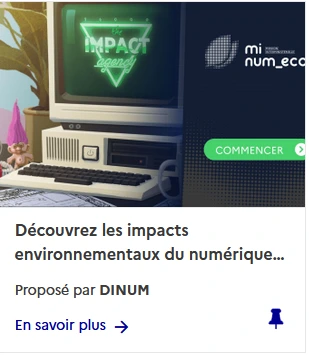
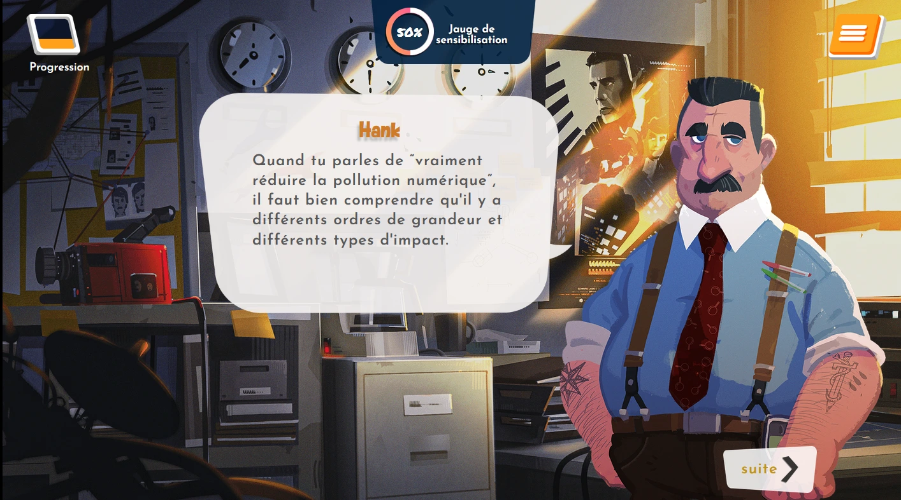

# Challenge inter-ministériel SEDD 2024 : Agir pour un numérique responsable

*À l’occasion de la Semaine Européenne du Développement Durable 2024, la DINUM et la MiNumEco lancent un challenge inter-ministériel sur la plateforme Mentor. Venez défier vos collègues et sensibilisez-vous au numérique responsable à travers un serious game immersif !*

* Challenge : Du 23 septembre au 18 octobre
* Format : serious game
* module d'1 heure sur mentor
* Sensibilisation aux enjeux du numérique responsable

<a href="https://mentor.gouv.fr/local/catalog/pages/training.php?trainingid=2825
" class="fr-btn" target="_blank" title="Nouvelle fenêtre : Inscription">Participer</a>

### la Semaine Européenne du Développement Durable

Du **18 septembre au 8 octobre 2024**, la **[Semaine Européenne du Développement Durable (SEDD)](https://www.service-public.fr/particuliers/actualites/A16744)** revient pour sensibiliser les citoyens européens aux enjeux environnementaux, sociaux et économiques, tout en promouvant les **17 Objectifs de Développement Durable (ODD)** de [l'Agenda 2030](https://www.agenda-2030.fr/agenda-2030/). Lancée en France en 2003 et devenue un événement européen en 2015, la SEDD a pour mission d'inciter les citoyens, les organisations et les institutions à agir pour un monde plus durable. Chaque année, des milliers de projets sont organisés autour de ces objectifs, afin de favoriser la prise de conscience et le passage à l’action.

- [L'Agenda 2030](https://www.agenda-2030.fr/agenda-2030/), l'objectif de transformation de notre monde pour renforcer la paix, en éradiquant la pauvreté et en assurant sa transition vers un développement durable
- [Les objectifs de développement durable](https://www.agenda-2030.fr/agenda-2030/presentation/article/presentation-origines-et-principes) les objectifs pour atteindre un monde durable
- [Datavisualisation des avancées de la France en matière d'ODD](https://www.agenda-2030.fr/rosace/index2023.html)

Ensemble, engageons-nous pour un numérique plus vert, aligné sur les objectifs de l'Agenda 2030 !

Cette année, la **DINUM** (Direction interministérielle du numérique) et la **MiNumEco** (Mission numérique écoresponsable) se joignent à cet effort en organisant un **challenge inter-ministériel** autour d’un serious game dédié au **numérique responsable**. Ce défi, qui se déroulera du **23 septembre au 18 octobre 2024**, est ouvert à tous les agents publics, dans le but de sensibiliser aux enjeux environnementaux du numérique et de promouvoir des pratiques plus respectueuses de la planète.

## Le numérique responsable : un levier pour un développement durable

Le **numérique** est omniprésent dans nos vies, mais son impact environnemental est souvent ignoré ou minimisé. Pourtant, de la production des appareils électroniques à leur consommation d'énergie, en passant par la gestion des déchets électroniques, l'empreinte environnementale du numérique est significative. La réduction de cet impact fait partie intégrante des **Objectifs de Développement Durable (ODD)**, qui visent à établir des modes de consommation et de production plus durables, à protéger l’environnement et à lutter contre les changements climatiques.

En France, le [plan de transition écologique des services publics](/posts/lancement-plan-transformation-eco-etat/), nous engage à réduire notre empreinte environnementale de 22% d'ici 2027. L'objectif 8 de ce plan de transition porte sur un numérique public plus responsable, à travers l'allongement de la durée de vie du matériel, le suivi des performances des data center et la dotation en matériel issu du réemploi.

C'est dans ce contexte que le **challenge SEDD 2024** invite les agents ministériels à explorer les solutions pour un **numérique plus responsable**, en adoptant une compréhension des pratiques qui réduisent les émissions de gaz à effet de serre, économisent les ressources naturelles et favorisent la sobriété numérique.

## Le Challenge SEDD 2024 : un serious game pour sensibiliser au numérique écoresponsable

Le **Challenge inter-ministériel SEDD 2024** se déroule sous la forme d'un **serious game** intitulé **The Impact Agency**, où les participants deviennent des détectives privés qui enquêtent sur une entreprise de technologies qui fabriqueraient des téléphones « zéro carbone ». Ce jeu immersif vise à sensibiliser les participants aux pratiques numériques qui impactent l'environnement.

## Scénario

Une grande entreprise high-tech est sur le point de lancer LE smartphone révolutionnaire de l’année… jusqu’à ce qu’un message mystérieux apparaisse sur tous leurs écrans, semant la panique. 😱 C’est là que vous entrez en scène, aux côtés de vos partenaires détectives Axel, Joy et Hank. Votre mission : découvrir la vérité cachée derrière ce lancement qui pourrait bien avoir des conséquences inattendues. 🌍

Votre enquête vous mènera à explorer les impacts sociaux, environnementaux et éthiques du numérique. Attention, rien n’est aussi simple qu’il n’y paraît. Seriez-vous capable de déjouer les apparences et de mettre à jour ce qui se cache derrière cette innovation soi-disant “zéro carbone” ? 🔍

*Jeu développé par Dowino et better for good.*

### Un challenge entre agents publics

En participant au challenge, chaque agent peut contribuer à faire gagner des points à son ministère. En répondant correctement à au moins 80 % des questions, les participants recevront :
- Le **badge SEDD 2024**, témoignant de leur maîtrise des enjeux du numérique responsable.
- Une **attestation de réussite** via la plateforme **Mentor**, valorisant leur engagement dans cette démarche écoresponsable.

Le module est accessible via la plateforme de formation des agents publics LIEN MENTOR. Les inscriptions sont ouvertes à partir du 18 septembre et vous pourrez participer au **challenge du 23 septembre au 18 octobre**.

Les résultats du challenge seront publiés à l’issue de la période, désignant le ministère vainqueur. Cependant, l'objectif final est de mobiliser l’ensemble des agents pour un **numérique plus durable**, en lien avec les grandes orientations de l’Agenda 2030.

### Le serious game : une formation ludique et engageante

Dans **The Impact Agency**, les participants sont confrontés à une intrigue où ils doivent :
- **Déjouer le greenwashing** et identifier les vraies pratiques écoresponsables.
- Comprendre les **impacts environnementaux du numérique**, depuis la production des appareils jusqu'à leur utilisation.
- Découvrir des **solutions concrètes** pour adopter quelques gestes numérique responsable et une posture de questionnement des pratiques en fonction de leur impact environnemental.

Le jeu est structuré en trois chapitres, chacun axé sur un aspect spécifique du numérique responsable :
1. **Usages numériques** : Explorer les bonnes pratiques pour réduire son empreinte numérique quotidienne.
2. **Matériel** : Comprendre l’impact écologique des équipements numériques.
3. **Impacts globaux** : Prendre conscience des répercussions tant environnementales que sociales de la surconsommation technologique.

### Comment participer ?

- **Date du challenge** : Du 23 septembre au 18 octobre 2024
- **Inscription** : [Inscrivez-vous dès à présent sur Mentor](https://enattentedulienmentor)
- **Durée du jeu** : Moins d’une heure pour compléter l’ensemble des chapitres

<a href="https://mentor.gouv.fr/local/catalog/pages/training.php?trainingid=2825" class="fr-btn" target="_blank" title="Nouvelle fenêtre : Inscription">Participer</a>

---

### Informations clés
- **Semaine Européenne du Développement Durable** : Du 18 septembre au 8 octobre 2024 - [Ajouter à son agenda](https://www.service-public.fr/particuliers/download-echeance-actu-ics-calendar/A16744)
- **Challenge inter-ministériel** : [Serious Game sur le numérique responsable du 23 septembre au 18 octobre](https://mentor.gouv.fr/local/catalog/pages/training.php?trainingid=2825)

Ensemble, engageons-nous pour un numérique plus vert, aligné sur les objectifs de l'Agenda 2030 !

